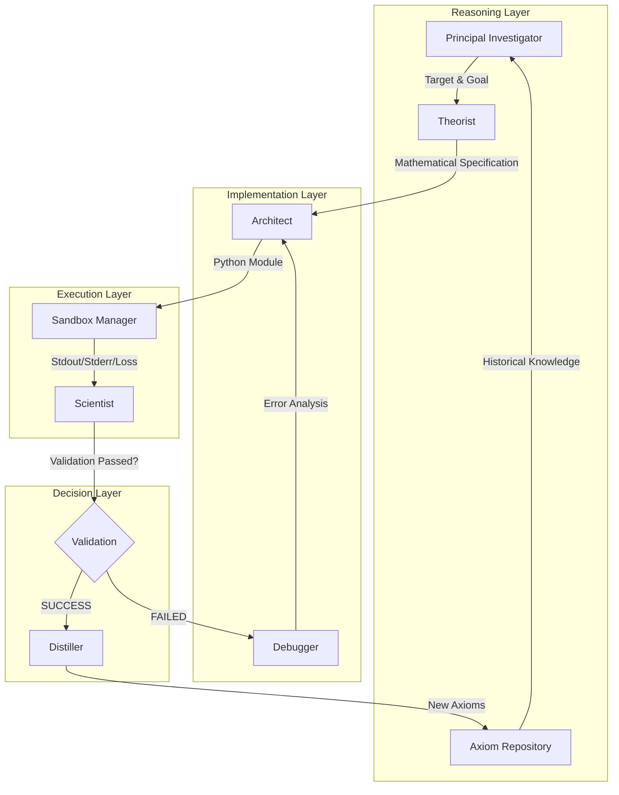

# ARCHITECTURE: The UARH Brain

The Universal Autonomous Research Harness (UARH) is architected as a **Dynamic State Graph**. Unlike traditional linear pipelines, UARH treats research as a non-linear optimization problem where the state of the graph evolves based on feedback from real-world execution.

## 1. The Orchestration Graph

UARH utilizes a directed acyclic graph (DAG) for its primary logic, but allows for **Recursive Correction Loops** (Debugger -> Architect) and **Iterative Refinement** (Axioms -> Principal Investigator).

### Visual State Logic

## 2. The Governor & State Machine
The core of UARH is the `Governor`. It maintains a global `ResearchState` object which persists throughout the cycles. 

### Key State Components:
- **`run_id`**: A unique UUID identifying the current experimental workspace.
- **`axioms`**: A list of compressed "Truths" discovered in previous runs that guide the current hypothesis.
- **`telemetry`**: Real-time metrics captured during Level 3 training.
- **`consecutive_failures`**: A safety counter. If too many hypotheses fail back-to-back, the Governor triggers a "Cooldown" or "Model Switch" to avoid burning API credits or compute.

## 3. Tiered Validation (The Safety Filter)
AI agents are prone to writing code that *looks* correct but fails during runtime. UARH implements a strict **3-Level Gate System** to ensure high-fidelity results.

### Level 1: Static Synthesis Check
- **Process**: The system attempts to dynamically import the generated `model.py` and training scripts.
- **Goal**: Catch SyntaxErrors, IndentationErrors, and obvious missing imports before the sandbox starts.

### Level 2: Smoke Test (Functional Verification)
- **Process**: A single batch of synthetic data (random noise) is passed through the model.
- **Goal**: Verify that:
    1. The model initializes on the requested device (CPU/CUDA/MPS).
    2. Tensor shapes are consistent across layers.
    3. The `backward()` pass doesn't trigger NaN gradients or memory leaks.

### Level 3: Micro-Training (Performance Verification)
- **Process**: The model is trained on the real dataset for a limited window (e.g., 50 steps).
- **Goal**: This is the "Truth" phase. The Scientist analyzes the loss curve. If the loss doesn't decrease (or remains stagnant), the run is marked as a "Logical Failure," even if the code ran perfectly.

## 4. Lineage & Persistence
Every decision made by the system is tracked in the `LineageRepository`. This ensures that even if the system crashes, we can reconstruct the exactly thought-process that led to a specific architecture. 

All runs are versioned in `workspace/runs/`, containing:
- `model.py`: The full implementation code.
- `run_log.txt`: The complete execution history.
- `hypothesis.json`: The PI's original reasoning.
